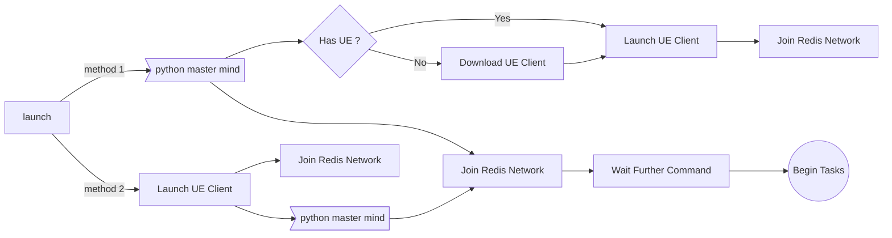
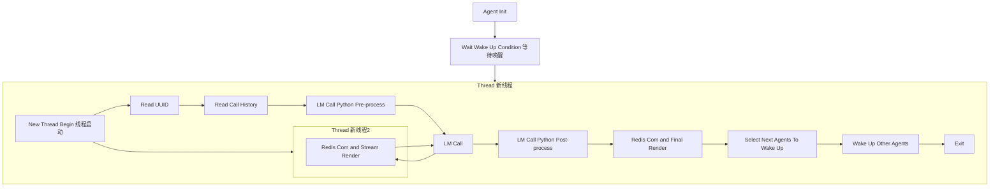
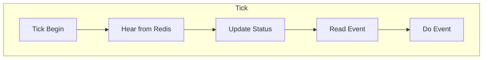
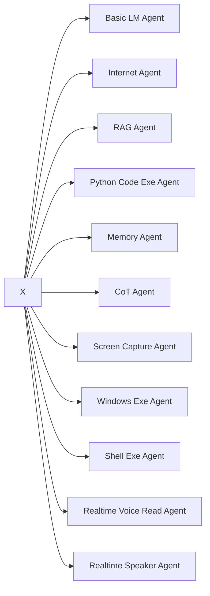

# Agent Matrix

The Core Insight of This Project: Achieving Higher Intelligence via **Nested** Agents.

## Initialize

## python agent tick

## unreal agent tick

## agent university base class

