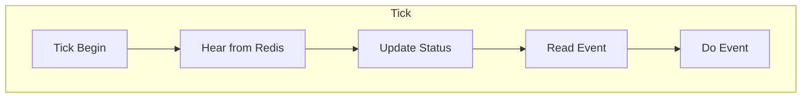
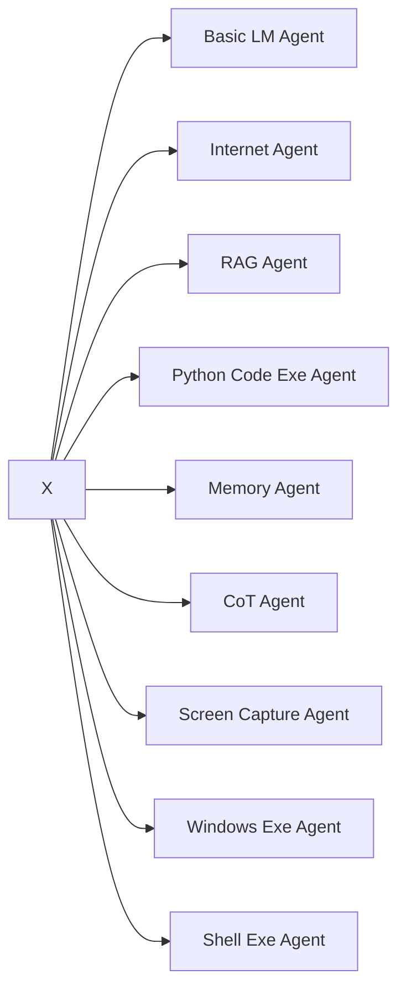

# agent-university

## unreal agent tick

```mermaid
flowchart TD
    subgraph Tick
        direction LR
        Tick_S["Tick Begin"] 
        --> Tick_A["Hear from Redis"]
        --> Tick_B["Update Status"]
        --> Tick_C["Read Event"]
        --> Tick_D["Do Event"]
    end
```

## agent university base class

```mermaid
flowchart LR
    Z["X"]
    Z --> A["Basic LM Agent"]
    Z --> B["Internet Agent"]
    Z --> C["RAG Agent"]
    Z --> D["Python Code Exe Agent"]
    Z --> E["Memory Agent"]
    Z --> F["CoT Agent"]
    Z --> G["Screen Capture Agent"]
    Z --> H["Windows Exe Agent"]
    Z --> I["Shell Exe Agent"]
```
