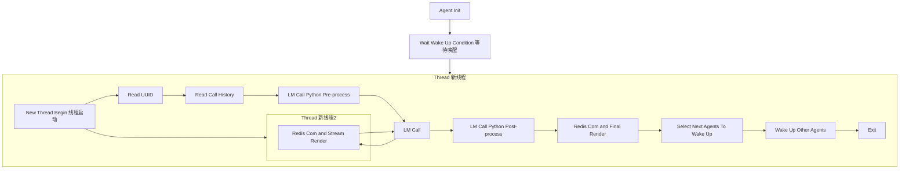
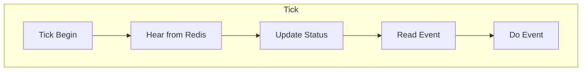
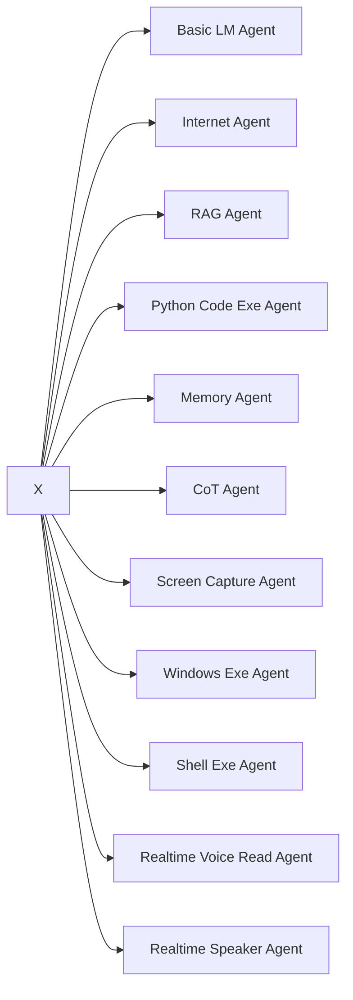

# Agent Matrix

<div align="center">

</div>

The Core Insight of This Project: Achieving Higher Intelligence via **Nested** Agents.

<div align="center">

</div>

## Initialize


## python agent tick




## unreal agent tick



## agent university base class




## Agent Activation Call Cycle

1. upper stream agent proxy call current agent proxy's `___on_agent_wakeup___`

2. [`___on_agent_wakeup___` (anywhere)] current agent modify msg (msg = `on_agent_wakeup`+arguments) and `send_to_real_agent`

3. [`send_to_real_agent` (agent_matrix/agent/agent_proxy.py)]: `message_queue_send_to_real_agent`

4. [`_begin_acquire_command` (agent_matrix/agent/agent.py)]: real agent receive msg and execute `_handle_command`

5. [`_handle_command` (agent_matrix/agent/agent.py)]: real agent receive `on_agent_wakeup` and execute `wakeup_in_new_thread` (in new thread)

```python
    def wakeup_in_new_thread(self, msg):
        # deal with the message from upstream
        msg.num_step += 1
        if msg.level_shift == '↑':
            # Case 1:
            # - This agent must be a parent with at leat one child agent,
            #   and all its children have finished their tasks.
            #   It is time that this parent exam all the work done by its children
            #   and decide what to do next.
            downstream = self.on_children_fin(msg.kwargs, msg)
        else:
            # Case 2:
            # - If this agent is a parent (with at least one child agent),
            #   on_agent_wakeup will be called, and its children will handle more work afterwards.
            # - If this agent has no children,
            #   on_agent_wakeup will be called.
            downstream = self.on_agent_wakeup(msg.kwargs, msg)

        # deliver message to downstream
        # (don't worry, agent proxy will deal with it,
        # e.g. chosing the right downstream agent)
        self.on_agent_fin(downstream, msg)
```

6. [`on_agent_wakeup` (agent_matrix/agent/agent.py)]: real agent receive and execute `on_agent_wakeup`

7. [`on_agent_fin` (agent_matrix/agent/agent.py)]: terminate agent task, prepare msg delivery, register `downstream` to `msg`
```python
    def on_agent_fin(self, downstream, msg):
        msg.src = self.agent_id
        msg.dst = self.proxy_id
        msg.command = "on_agent_fin"
        msg.kwargs = downstream
        # for switch agent, add downstream_override
        if downstream.get("downstream_override", None):
            msg.downstream_override = downstream["downstream_override"]
        # for groupchat agent, add children_select_override
        if downstream.get("children_select_override", None):
            msg.children_select_override = downstream["children_select_override"]
        if downstream.get("call_children_again", None):
            msg.call_children_again = downstream["call_children_again"]
        if downstream.get("dictionary_logger", None) and isinstance(downstream["dictionary_logger"], dict):
            msg.dictionary_logger.update(downstream["dictionary_logger"])
        # keep level shift unchanged
        msg.level_shift = msg.level_shift
        self._send_msg(msg)
```